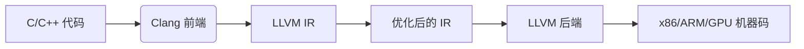

LLVM（Low Level Virtual Machine，最初命名时的缩写，现已成为正式名称）是一个开源的编译器基础设施项目，用于构建高度优化的编译器、编程语言工具链和运行时环境。它由一系列模块化的库和工具组成，专注于提供现代化的代码优化和跨平台支持。以下是关于 LLVM 的详细解析：

---

### **1. 核心组成部分**
| 组件                | 功能描述                                                                 |
|---------------------|--------------------------------------------------------------------------|
| **前端（Frontend）** | 将源代码（如 C/C++、Rust、Swift）转换为 LLVM 中间表示（IR）              |
| **中间表示（IR）**   | 与硬件无关的低级指令集，是优化和分析的核心载体                           |
| **优化器（Optimizer）** | 对 IR 进行跨平台的静态分析和优化（如内联、循环优化、死代码消除）       |
| **后端（Backend）**  | 将 IR 转换为目标机器代码（如 x86、ARM、GPU 指令）                        |
| **工具链**          | 包含汇编器、反汇编器、链接器等实用工具                                   |

---

### **2. 关键特性**
- **模块化设计**：允许开发者复用组件（如 Clang 作为 C/C++ 前端）。
- **跨平台支持**：支持从嵌入式设备到超级计算机的多种架构。
- **高性能优化**：提供比传统编译器（如 GCC）更激进的优化策略。
- **语言无关性**：通过 IR 支持多种编程语言（如 Rust、Swift、CUDA）。
- **JIT 编译**：支持动态编译（如 Python 的 Numba 加速）。

---

### **3. LLVM 与 CUDA/NVIDIA 的关系**
- **NVIDIA 的 LTOIR**：  
  从 CUDA 11 开始，NVIDIA 使用基于 LLVM 的工具链生成 LTOIR（Link Time Optimization IR），替代了早期的 PTX 优化流程。
  - 通过 `nvcc -dlto` 或 NVRTC 生成 LLVM-IR 格式的 LTOIR。
  - 使用 `nvJitLink` 链接时，依赖 LLVM 的优化和代码生成能力。

- **cuobjdump 的替代**：  
  如果 `cuobjdump` 无法解析 LTOIR，可尝试 LLVM 工具链：
  ```bash
  llvm-dis your_file.ltoir -o - | less  # 反汇编为可读文本
  ```

---

### **4. 实际应用场景**
#### **(1) 静态编译（传统用途）**


#### **(2) GPU 代码优化（CUDA 场景）**
- **输入**：CUDA 内核（`.cu` 文件）
- **流程**：
  1. `nvcc` 或 NVRTC 将 CUDA 代码编译为 LLVM-IR 格式的 LTOIR。
  2. `nvJitLink` 调用 LLVM 的链接时优化（LTO）和代码生成。
  3. 生成最终的 GPU 二进制（如 `cubin`）。

#### **(3) 动态 JIT 编译**
- **示例**：PyTorch 使用 LLVM 即时编译高性能算子。

---

### **5. 常用工具**
| 工具                | 用途                                     | 示例命令                              |
|---------------------|------------------------------------------|---------------------------------------|
| `clang`            | C/C++ 前端编译器                         | `clang -S -emit-llvm test.c -o test.ll` |
| `llvm-dis`         | 将二进制 IR 反汇编为可读文本             | `llvm-dis file.bc -o -`               |
| `opt`              | IR 优化器                                | `opt -O3 file.ll -o optimized.ll`     |
| `llc`              | IR 到目标代码的静态编译器                | `llc -march=x86-64 file.ll -o file.s` |
| `llvm-objdump`     | 分析目标文件（含 LTOIR）                 | `llvm-objdump --syms file.ltoir`      |

---

### **6. 为什么 LLVM 重要？**
- **灵活性**：允许自定义编译器流程（如添加新优化 pass）。
- **性能**：优化能力超越传统编译器（尤其在自动向量化、多线程优化方面）。
- **生态**：被 Apple（Swift）、Microsoft（.NET）、NVIDIA（CUDA）等巨头采用。

---

### **7. 学习资源**
- 官网：[llvm.org](https://llvm.org/)
- 经典书籍：《LLVM Cookbook》
- 实践教程：通过 `clang -emit-llvm -S` 生成 IR 并手动优化。

如果需要深入 LLVM 在 CUDA 中的应用，可研究 NVIDIA 的 [libNVVM](https://docs.nvidia.com/cuda/libnvvm-api/index.html) 文档。