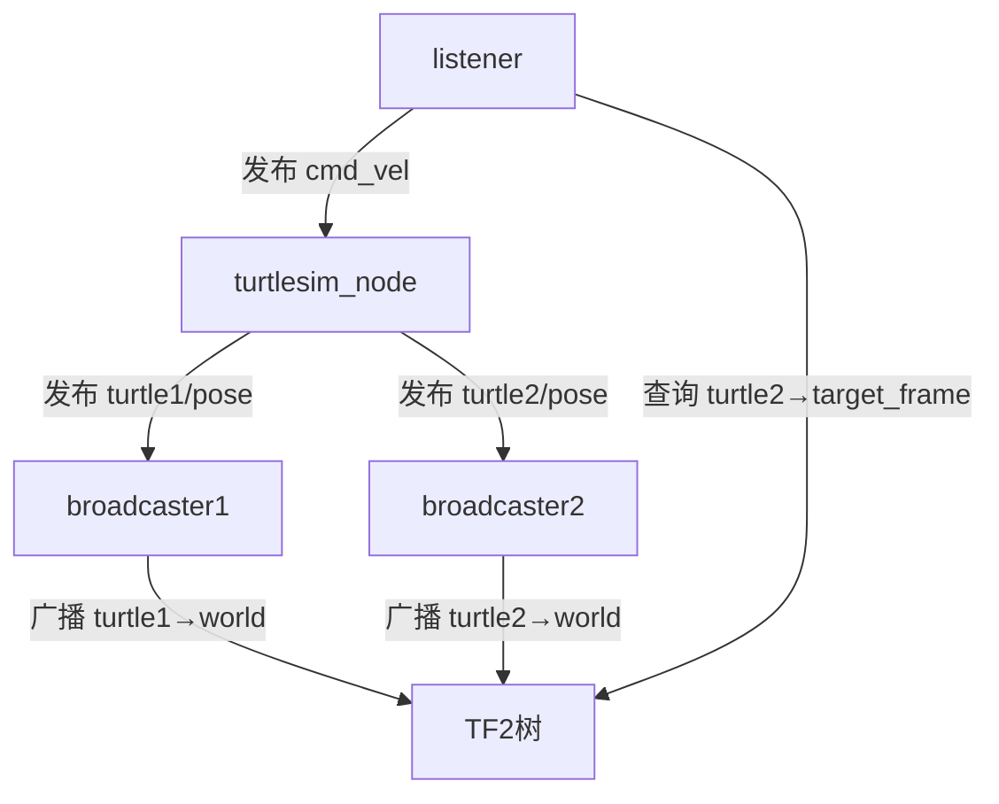

[Writing a listener (Python) — ROS 2 Documentation: Jazzy documentation](https://docs.ros.org/en/jazzy/Tutorials/Intermediate/Tf2/Writing-A-Tf2-Listener-Py.html)

这段ROS 2的Launch文件定义了多个节点，用于启动一个**Turtlesim仿真环境**并演示**TF2坐标变换**的功能。以下是各节点的详细作用解析：

---

### **1. `turtlesim_node`（基础仿真）**
```python
Node(
    package='turtlesim',
    executable='turtlesim_node',
    name='sim'
)
```
- **功能**：  
  启动Turtlesim仿真器，提供一个可视化窗口，显示两只乌龟（`turtle1`和`turtle2`）的二维运动。  
- **关键参数**：  
  - `name='sim'`：将节点名称重命名为`sim`（默认名称为`turtlesim`）。

---

### **2. `turtle_tf2_broadcaster`（广播`turtle1`的坐标系）**
```python
Node(
    package='learning_tf2_py',
    executable='turtle_tf2_broadcaster',
    name='broadcaster1',
    parameters=[{'turtlename': 'turtle1'}]
)
```
- **功能**：  
  监听`turtle1`的位姿（位置和朝向），并将其**发布到TF2树**中，建立名为`turtle1`的坐标系。  
- **关键参数**：  
  - `turtlename: 'turtle1'`：指定要跟踪的乌龟名称（对应Turtlesim中的`turtle1`）。  
- **TF2作用**：  
  其他节点可通过TF2查询`turtle1`相对于世界坐标系（`world`）或其他坐标系的变换。

---

### **3. `turtle_tf2_broadcaster`（广播`turtle2`的坐标系）**
```python
Node(
    package='learning_tf2_py',
    executable='turtle_tf2_broadcaster',
    name='broadcaster2',
    parameters=[{'turtlename': 'turtle2'}]
)
```
- **功能**：  
  同理，监听`turtle2`的位姿，发布名为`turtle2`的坐标系到TF2树。  
- **注意**：  
  两个`broadcaster`节点通过不同的名称（`broadcaster1`和`broadcaster2`）和参数（`turtle1`/`turtle2`）区分。

---

### **4. `DeclareLaunchArgument`（动态参数声明）**
```python
DeclareLaunchArgument(
    'target_frame', default_value='turtle1',
    description='Target frame name.'
)
```
- **功能**：  
  定义一个启动参数`target_frame`，默认值为`turtle1`，允许用户在启动时修改目标坐标系（例如改为`turtle2`）。  
- **使用场景**：  
  通过命令行动态指定目标帧：  
  ```bash
  ros2 launch <package> <launch_file> target_frame:=turtle2
  ```

---

### **5. `turtle_tf2_listener`（监听TF变换并控制运动）**
```python
Node(
    package='learning_tf2_py',
    executable='turtle_tf2_listener',
    name='listener',
    parameters=[{'target_frame': LaunchConfiguration('target_frame')}]
)
```
- **功能**：  
  - 查询`turtle2`相对于`target_frame`（默认`turtle1`）的坐标变换。  
  - 根据变换结果计算控制指令，使`turtle2`**自动移动**到`target_frame`的位置。  
- **关键参数**：  
  - `target_frame`：通过`LaunchConfiguration`动态获取用户输入的目标坐标系。  
- **底层逻辑**：  
  该节点会订阅TF2数据，计算`turtle2`与目标坐标系之间的**距离和角度差**，然后发布`/turtle2/cmd_vel`话题控制`turtle2`移动。

---

### **节点交互流程图**


---

### **总结功能**
1. **仿真环境**：`turtlesim_node`提供乌龟可视化。
2. **坐标广播**：两个`broadcaster`节点分别发布`turtle1`和`turtle2`的坐标系。
3. **坐标监听与控制**：`listener`节点根据TF2数据控制`turtle2`追踪`target_frame`（默认追踪`turtle1`）。

---

### **典型应用场景**
- **TF2教学**：演示如何发布、查询和使用坐标变换。  
- **多机器人协作**：模拟一个机器人追踪另一个机器人的运动。  
- **动态参数测试**：通过修改`target_frame`测试不同追踪目标。