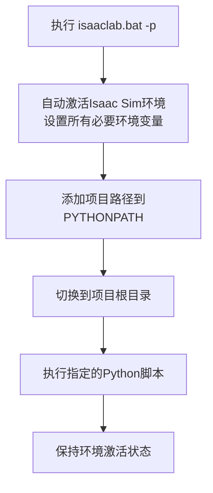

### 使用VSCode运行脚本

```powershell
.\isaaclab.bat -p scripts/environments/list_envs.py
```

`isaaclab.bat -p` 是 NVIDIA Isaac Lab 框架提供的一个便捷启动命令，用于**快速创建并启动一个新的Python任务/实验**。让我为你详细解释它的用途和用法。

## 📌 命令含义解析

### 基本作用
- **`isaaclab.bat`**：这是 Isaac Lab 项目提供的主要启动脚本（Windows系统）。
- **`-p` 参数**：是 `--python` 的简写，表示“我要运行一个Python脚本或模块”。

### 完整命令格式
```bash
isaaclab.bat -p <python_script_or_module> [其他参数]
```

## 🚀 实际使用示例

### 示例1：运行指定脚本
```bash
# 在项目根目录下执行
isaaclab.bat -p scripts/train.py

# 或指定完整路径
isaaclab.bat -p E:\Isaac\IsaacLab\scripts\train.py
```

### 示例2：运行带参数的任务
```bash
# 运行特定任务并传递参数
isaaclab.bat -p scripts/train.py --task AllegroHand --num_envs 128

# 简写形式（某些版本支持）
isaaclab.bat -p train --task Cartpole --headless
```

### 示例3：运行Python模块
```bash
# 运行作为模块的脚本
isaaclab.bat -p scripts.environments.list_envs

# 这会执行 scripts/environments/list_envs.py
```

## 🔧 工作原理解析

当你执行 `isaaclab.bat -p` 时，实际上发生了：



## 📝 常用参数对照表

| 参数 | 全称 | 功能说明 |
|------|------|----------|
| `-p` | `--python` | **核心参数**：指定要运行的Python脚本 |
| `--task` | | 指定要训练/运行的任务名称 |
| `--num_envs` | | 设置并行环境数量 |
| `--headless` | | 无头模式（不打开图形界面） |
| `--cpu` | | 强制使用CPU（默认可使用GPU） |
| `--device` | | 指定计算设备，如 `cuda:0` |

## 💡 实际工作场景示例

### 场景1：快速启动训练
```bash
# 在IsaacLab项目根目录打开终端
isaaclab.bat -p scripts/train.py --task AllegroHand --num_envs 64 --headless
```

### 场景2：环境列表查看
```bash
# 查看所有可用环境
isaaclab.bat -p scripts/environments/list_envs.py
```

### 场景3：VSCode集成使用
在VSCode的终端中，你可以：
1. 切换到IsaacLab项目目录
2. 直接运行：
```bash
.\isaaclab.bat -p scripts/train.py --task Cartpole
```

## ⚠️ 常见问题与解决方案

### 问题1：找不到 `isaaclab.bat`
**解决方案**：
```bash
# 确保你在IsaacLab项目根目录
cd /d E:\Isaac\IsaacLab

# 检查文件是否存在
dir isaaclab.bat

# 如果不存在，可能需要从官方获取或使用其他启动方式
```

### 问题2：权限不足
**解决方案**：
```bash
# 以管理员身份运行VSCode或终端
# 或检查文件权限
```

### 问题3：参数传递错误
**正确格式**：
```bash
# 错误：参数位置不对
isaaclab.bat scripts/train.py -p --task Cartpole  ❌

# 正确：-p后直接跟脚本
isaaclab.bat -p scripts/train.py --task Cartpole  ✅
```

## 🔍 高级用法：查看帮助

想知道更多可用参数：
```bash
# 查看所有可用参数
isaaclab.bat --help

# 或
isaaclab.bat -h
```

## 📊 与传统方式的对比

| 启动方式 | 命令示例 | 优点 | 缺点 |
|---------|----------|------|------|
| **直接Python** | `python scripts/train.py` | 简单直接 | 需要手动激活环境 |
| **通过kit.exe** | `kit/python/kit.exe script.py` | 可访问所有Isaac Sim功能 | 环境变量需手动配置 |
| **isaaclab.bat -p** | `isaaclab.bat -p train.py` | **自动处理环境，推荐** | 需要项目提供此脚本 |

## 🎯 最佳实践建议

1. **优先使用**：在IsaacLab项目中，优先使用 `isaaclab.bat -p` 而不是直接运行Python。
2. **参数验证**：传递参数时，确保脚本能接收这些参数（检查对应Python脚本的argparse配置）。
3. **调试技巧**：如果想看具体执行了什么，可以临时编辑 `isaaclab.bat` 文件，在开头添加 `@echo on`。

如果你需要运行特定的任务或遇到参数传递的问题，可以告诉我你想执行的具体脚本和参数，我能帮你提供更针对性的命令示例。